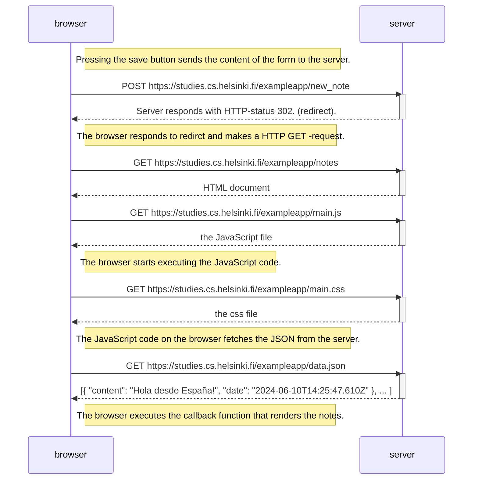

```mermaid
sequenceDiagram
    participant browser
    participant server

Note right of browser: Pressing the save button sends the content of the form to the server.
    browser->>server: POST https://studies.cs.helsinki.fi/exampleapp/new_note
    activate server
    server-->>browser: Server responds with HTTP-status 302. (redirect).
    deactivate server

Note right of browser: The browser responds to redirct and makes a HTTP GET -request.
    browser->>server: GET https://studies.cs.helsinki.fi/exampleapp/notes
    activate server
    server-->>browser: HTML document
    deactivate server

    browser->>server: GET https://studies.cs.helsinki.fi/exampleapp/main.js
    activate server
    server-->>browser: the JavaScript file
    deactivate server
Note right of browser: The browser starts executing the JavaScript code.

    browser->>server: GET https://studies.cs.helsinki.fi/exampleapp/main.css
    activate server
    server-->>browser: the css file
    deactivate server

Note right of browser: The JavaScript code on the browser fetches the JSON from the server.
    browser->>server: GET https://studies.cs.helsinki.fi/exampleapp/data.json
    activate server
    server-->>browser: [{ "content": "Hola desde España!", "date": "2024-06-10T14:25:47.610Z" }, ... ]
    deactivate server

Note right of browser: The browser executes the callback function that renders the notes.
```
