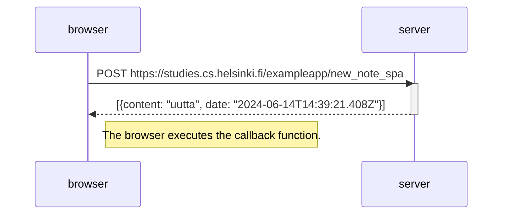

```mermaid
sequenceDiagram
    participant browser
    participant server

    browser->>server: POST https://studies.cs.helsinki.fi/exampleapp/new_note_spa
    activate server
    server-->>browser: [{content: "uutta", date: "2024-06-14T14:39:21.408Z"}]
    deactivate server

Note right of browser: The browser executes the callback function.
```
